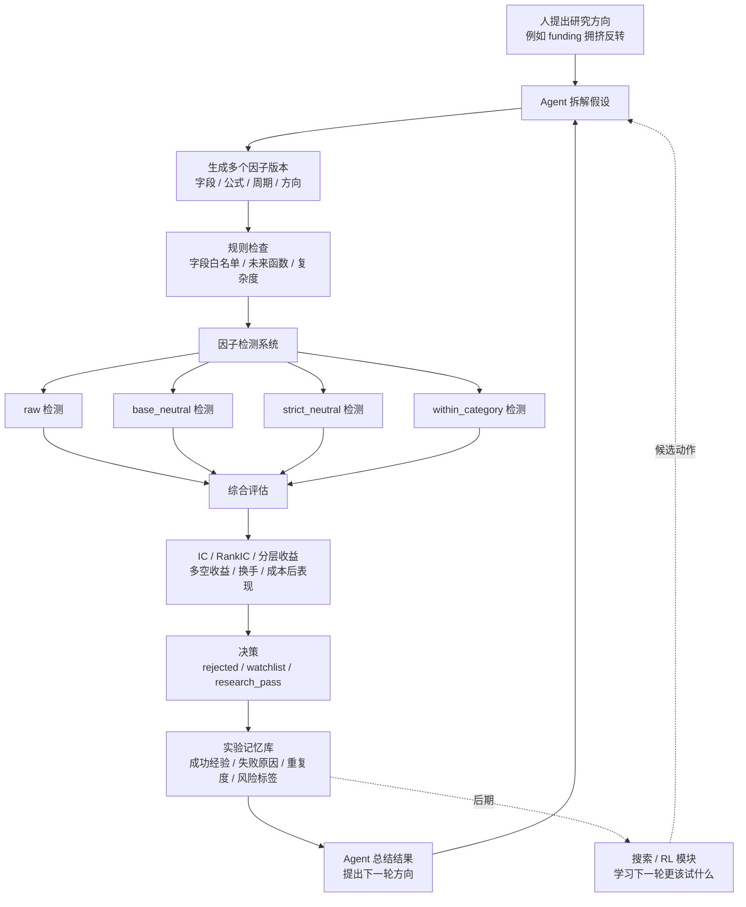

# Agent 因子挖掘路线方案

## 1. 研究背景：现在大家为什么在看 Agent 挖因子

传统因子研究一般是这样做的：

```text
研究员提出市场想法
-> 写公式或特征
-> 跑历史测试
-> 看 IC、分层收益、多空收益、换手和成本
-> 留下有效因子，放弃无效因子
```

机构可以靠研究员团队、数据团队和成熟回测平台来持续做这件事。个人研究者的问题是：时间少、经验覆盖面有限、一次只能研究少数方向，很多测试结果也容易忘记。

Agent 挖因子的价值不是让 AI 直接替代研究员，而是把它当成一个长期研究助理：

```text
你给方向或问题
-> Agent 拆成可测试假设
-> Agent 生成多个公式版本
-> 系统自动测试
-> Agent 总结结果和下一轮方向
-> 经验进入因子库和实验记忆
```

这更适合当前项目：我们先做一个可控的个人因子研究工厂，而不是一开始追求完全自动化。

## 2. 当前论文和技术趋势的大白话总结

目前最新方向大致分三类：

1. **LLM / Agent 做研究助理**
   - 代表思路：Alpha-GPT、FAMA、GPT-Signal。
   - 作用：把人的模糊想法转成公式和实验任务。
   - 问题：如果没有规则和回测约束，容易生成听起来合理但实际没用的因子。

2. **受控 Agent 做自动因子搜索**
   - 代表思路：AlphaAgent、Hubble、FactorMiner。
   - 作用：让 Agent 在安全的公式语言、因子库、回测系统和经验记忆里循环。
   - 重点：防止重复、过拟合、未来函数和不可解释。

3. **Agent + RL / 搜索算法做自进化**
   - 代表思路：AlphaAgentEvo、AlphaSAGE、LLM + MCTS。
   - 作用：Agent 负责理解和总结，RL/MCTS/GFlowNet 负责更系统地搜索公式和参数。
   - 状态：属于前沿方向，不适合作为第一版核心。

一句话：现在更合理的路线不是“让 LLM 自由发挥”，而是给它一个有规则、有回测、有记忆、有刹车的研究环境。

## 3. 为什么选择这条路线

本项目是分钟级 Crypto 截面因子研究系统，当前已经有第一版因子检测口径：

- `raw`
- `base_neutral`
- `strict_neutral`
- `within_category`

这很适合 Agent 挖因子，因为 Agent 生成的每个想法都可以被同一套系统严格测试。

我们选择“先 Agent 助理，后半自动循环，最后再考虑 Agent + RL”的原因：

1. **个人研究更需要提高探索效率**
   - Agent 可以帮一个人快速扩展研究方向。
   - 不需要一开始就有很多研究员。

2. **第一版必须可控**
   - 先让 Agent 输出公式和实验任务。
   - 不让它直接执行任意代码。
   - 不让它自己改评判标准。

3. **Crypto 容易有伪规律**
   - 小币、流动性、资金费率、板块轮动都可能制造假信号。
   - 必须用中性化、成本、去相关、样本外检查来约束。

4. **RL 需要大量历史实验**
   - 没有几千到几万条实验记录，直接训练 RL 意义不大。
   - 前期更应该先沉淀因子库和实验记忆。

## 4. 系统角色分工

### 人

负责研究边界和最终判断：

- 哪些方向值得研究。
- 哪些数据可以使用。
- 什么结果可以进入候选因子库。
- 哪些结论看起来不可信。

### Agent

负责研究助理工作：

- 把模糊想法拆成可测试假设。
- 生成多个公式版本。
- 阅读实验结果并总结。
- 根据失败经验提出下一轮改进。

### 因子检测系统

负责裁判：

- 计算因子值。
- 做清洗、标准化、中性化、板块内检测。
- 计算 IC、Rank IC、分层收益、多空收益、换手、成本后表现。
- 输出 `rejected`、`watchlist`、`research_pass`。

### 实验记忆库

负责让系统越做越不重复：

- 记录每个假设。
- 记录每个公式。
- 记录参数、周期、数据字段、测试结果。
- 记录失败原因和风险标签。
- 记录和已有因子的相似度。

### RL / 搜索算法（后期）

负责学习“下一轮更该怎么试”：

- 它不是裁判。
- 它不决定金融逻辑对不对。
- 它根据已有评分学习哪些公式结构、窗口、字段组合更值得探索。

## 5. 阶段路线

### 第一版：Agent 研究助理

目标：让 Agent 帮一个人更快地提出和拆解因子想法。

工作方式：

```text
人提出方向
-> Agent 拆成多个研究假设
-> Agent 输出公式草案和实验配置
-> 系统跑测试
-> Agent 解释结果
-> 人决定下一轮
```

第一版应该支持的输入：

```text
我想研究 funding 拥挤反转。
请拆成 5-10 个 Crypto 分钟级截面因子版本，
说明使用字段、预测方向、预测周期、风险和测试标准。
```

第一版应该输出：

- 因子主题。
- 大白话逻辑。
- 使用字段。
- 公式草案。
- 预测方向。
- 预测周期。
- 需要中性化的风险暴露。
- 未来函数风险。
- 通过或拒绝标准。

第一版不做：

- 不训练 RL。
- 不让 Agent 直接执行任意 Python。
- 不自动把因子放进生产交易。
- 不追求完全自主挖因子。

### 第二版：Agent 半自动研究循环

目标：让 Agent 不只响应人的想法，也能根据历史实验记录自己提出下一轮方向。

工作方式：

```text
Agent 读取历史实验
-> 找出有效方向、失败方向、重复方向
-> 自动提出下一轮研究菜单
-> 人审核后执行
-> 系统测试
-> Agent 更新实验记忆
```

第二版新增能力：

- 因子实验数据库。
- 因子相似度检查。
- 失败原因归档。
- Agent 自动生成研究菜单。
- Agent 自动写实验复盘。
- 每周或每天生成候选研究报告。

第二版重点不是完全自动，而是让人只看高质量候选。

### 第三版：受控自动探索

目标：让 Agent 在设定好的边界内自动跑更多实验。

工作方式：

```text
人设定预算和边界
-> Agent 自动选择研究主题
-> Agent 生成公式
-> 系统自动测试
-> 系统自动去重和风险过滤
-> Agent 输出 Top 候选
```

第三版需要加入：

- 公式 DSL 或 AST 沙箱。
- 允许字段白名单。
- 允许算子白名单。
- 复杂度限制。
- 未来函数检查。
- 样本外检查。
- 成本和换手约束。
- 每轮实验预算控制。

第三版的关键原则：

```text
Agent 可以自动探索，但只能在轨道里跑。
```

### 最终版：Agent + 搜索 / RL 自进化

目标：让系统从历史实验里学习，自动提高搜索效率。

推荐结构：

```text
Agent：负责理解目标、提出方向、解释结果
搜索/RL：负责在方向内大量尝试公式和参数
回测系统：负责评分
规则系统：负责防止作弊和过拟合
人：负责最终研究边界和上线判断
```

RL 的奖励不应该只看收益，而应该是综合评分：

```text
加分：
- Rank IC 稳定
- ICIR 高
- 分层收益单调
- 多空收益扣成本后有效
- 样本外也有效
- 和旧因子相关性低
- 公式简单可解释

扣分：
- 换手太高
- 成本后失效
- 只在一小段历史有效
- 和旧因子高度重复
- 公式太复杂
- 疑似未来函数
- 流动性太差
```

最终版可以考虑的算法：

- Bandit：给更有产出的研究方向分配更多实验预算。
- MCTS：在公式树里做更系统的搜索。
- GFlowNet：生成一批高质量且多样化的因子。
- GRPO/PPO 类方法：真正训练 Agent 的策略，但成本最高。

## 6. 推荐实现流程图



## 7. 第一版建议落地范围

第一版只需要做轻量闭环：

1. **Prompt 模板**
   - 用固定模板让 Agent 输出研究任务。
   - 输出格式尽量结构化，后面方便转成配置。

2. **因子任务结构**
   - `factor_name`
   - `hypothesis`
   - `required_fields`
   - `formula_draft`
   - `direction`
   - `horizons`
   - `neutralization_profile`
   - `risk_checks`
   - `acceptance_rule`

3. **人工确认执行**
   - 第一版由人选择要跑哪些任务。
   - 不自动批量执行所有 Agent 输出。

4. **实验结果摘要**
   - Agent 读取结果后，用固定模板总结：
     - 哪些有效。
     - 哪些无效。
     - 可能为什么。
     - 是否重复。
     - 下一轮怎么改。

## 7.1 当前系统升级执行方案

目标是把现有“单因子检测系统”升级为围绕用户使用流程展开的 Agent 因子研究工作台。第一版闭环不再只按后端流水线表达，而是对齐 UI 的 8 步流程：

```text
1 提出目标
-> 2 Agent 拆解任务
-> 3 拉取数据
-> 4 生成候选因子
-> 5 批量回测
-> 6 人工审核
-> 7 入库/组合
-> 8 监控迭代
```

Agent 负责提出假设、拆解任务、解释结果和给出下一轮建议；现有因子检测系统继续负责计算与裁判。UI 视觉和页面组织以 `UI_DESIGN_GUIDE.md` 与 `ui/agent_factor_ui_overview.png` 为基准，后续生成的界面都要向这个设计收敛。

### UI 对齐原则

- `Agent 挖因子` 是核心页面：用户从这里输入研究目标、查看 Agent 拆解、审核候选任务并触发回测。
- `数据地图` 负责解释第 3 步：字段是否可得、数据源是否已接入、哪些任务为什么 `blocked`。
- `因子实验室` 负责解释第 4 步：公式草案如何映射到 `formula_key + formula_params`，以及字段、窗口、方向是否合规。
- `回测与归因` 负责解释第 5 步：展示 raw/base_neutral/strict_neutral/within_category 下的 IC、收益、回撤、换手和风险暴露。
- `因子库` 和 `组合工作台` 承接第 7 步：只有人工审核通过的因子才能入库或进入组合配置。
- `监控与告警` 承接第 8 步：展示因子衰减、漂移、缺数、重跑提醒，并把复盘结果回流给 Agent。
- `报告中心` 贯穿全流程：把目标、任务、实验、审核和下一轮建议生成研究备忘录。

### 核心原则

- 第一版不训练 RL，不接入搜索算法自进化。
- 第一版不让 Agent 执行任意 Python，也不解析自由文本公式直接运行。
- Agent 只输出结构化研究任务；只有人工确认后的任务才能进入执行。
- 因子好坏仍由 IC、Rank IC、分层收益、多空收益、覆盖率、成本后收益、稳定性、去相关和样本外表现判断。
- funding、OI、爆仓、盘口等字段缺失时，任务可以记录，但执行状态应标记为 `blocked`，不伪造数据。

### 第一版任务结构

Agent 输出的候选任务统一整理为结构化字段：

- `factor_name`：因子名称。
- `hypothesis`：因子假设和经济解释。
- `required_fields`：所需字段清单。
- `formula_draft`：人可读公式草案。
- `formula_key`：受控公式白名单中的执行键。
- `formula_params`：窗口、滞后、标准化等参数。
- `direction`：预测方向，使用 `positive` / `negative`。
- `horizons`：测试周期，如 `1h/4h/8h/24h/72h`。
- `neutralization_profile`：默认跑 `raw/base_neutral/strict_neutral/within_category`，必要时可指定子集。
- `risk_checks`：未来函数、字段可得性、流动性、成本、样本量等检查项。
- `acceptance_rule_version`：验收规则版本。
- `status`：`draft/approved/rejected/executed/blocked`。

### 目标模块改造

第一版建议新增 `src/factor_research/agent_mining` 模块，职责包括：

- 校验 Agent 任务结构、字段白名单、horizon 和方向。
- 将 `formula_key + formula_params` 映射为受控因子计算函数。
- 只执行 `status=approved` 的任务。
- 调用现有 pipeline、evaluation、decision。
- 生成实验摘要，供 Agent 做下一轮复盘。

DuckDB 建议新增实验记忆相关表：

- `agent_factor_tasks`：记录候选任务、状态、所需字段、公式草案、风险检查。
- `agent_factor_experiments`：记录每次执行批次、样本范围、horizon、profile、运行状态。
- `factor_evaluation`：记录 IC、Rank IC、分层收益、多空收益、覆盖率、换手、成本后收益。
- `factor_decision`：记录 `rejected/watchlist/research_pass`、失败原因、风险标签和规则版本。

这些表要同时服务后端执行和前端页面状态。字段设计时至少要能还原：目标来源、Agent 任务拆解、数据可得性、执行状态、人工审核状态、入库/组合状态、监控告警状态。

### 执行入口

新增脚本建议为：

```powershell
& "C:\Users\hp\anaconda3\envs\mt5\python.exe" scripts/run_agent_factor_tasks.py --db-path data/factor_research.duckdb --tasks configs/agent_factor_tasks.yaml
```

执行流程：

```text
1 读取用户研究目标或任务文件
-> 2 校验 Agent 拆解出的结构化任务
-> 3 检查字段可得性并标记 blocked
-> 4 用白名单公式生成候选 raw_factor
-> 5 对每个 horizon 跑现有四套检测口径
-> 6 等待或读取人工审核结果，只让通过项进入后续状态
-> 7 写入因子库/组合候选所需结果
-> 8 输出监控与 Agent 复盘所需摘要
```

### Prompt 与复盘模板

Prompt 模板只负责把研究方向转成结构化任务，不直接运行：

```text
请把这个研究方向拆成 5-10 个 Crypto 分钟级截面因子任务。
每个任务必须包含 factor_name、hypothesis、required_fields、formula_draft、
formula_key、formula_params、direction、horizons、neutralization_profile、
risk_checks、acceptance_rule_version。
只允许使用系统已给出的字段和公式白名单。
```

复盘模板固定总结：

- 哪些任务有效，在哪些 horizon/profile 有效。
- 哪些任务无效，主要失败原因是什么。
- 是否疑似只是流动性、波动、板块或小币暴露。
- 是否字段缺失、样本不足或存在未来函数风险。
- 下一轮建议保留、变体扩展或放弃哪些方向。
- UI 下一步应该把用户引导到哪个页面：继续拆解、补数据、看回测、人工审核、入库组合或监控告警。

### 第一版验收标准

- 能从一个 YAML/JSON 任务文件读取 Agent 候选因子。
- 非 `approved` 任务不会执行。
- 非白名单 `formula_key` 会被拒绝。
- 字段缺失任务会被标记为 `blocked`。
- 至少一个 OHLCV 类任务能跑通现有四套 profile 并落库。
- UI 能按 8 步流程看到候选任务、数据状态、公式映射、最近实验结果、人工审核、入库状态和监控状态。
- 后续 UI 生成必须参考 `ui/agent_factor_ui_overview.png`，页面体系和视觉风格不能回退到旧版深色量化平台。
- 原有 `run_v1_demo.py` 与 `run_v1_from_db.py` 保持可用。

## 8. 示例工作流

对应 UI 流程如下：

```text
1 提出目标：用户在 Agent 挖因子页面输入研究方向
2 Agent 拆解任务：Agent 生成多个候选方向和结构化任务
3 拉取数据：系统检查 funding、OI、OHLCV 等字段是否可得
4 生成候选因子：把公式草案映射到公式白名单
5 批量回测：跑 1h/4h/8h/24h 和四套检测口径
6 人工审核：用户选择通过、拒绝或标记为待补数据
7 入库/组合：通过项进入因子库，并可加入组合工作台
8 监控迭代：持续跟踪衰减和缺数，Agent 生成下一轮建议
```

输入：

```text
我来自外汇交易，对 Crypto 不熟。
我想研究“拥挤交易会不会反转”。
请帮我拆成可测试的 Crypto 分钟级截面因子。
```

Agent 输出：

```text
方向 1：funding 过高后的反转
方向 2：open interest 上升但价格涨不动
方向 3：爆仓后短期反弹或延续
方向 4：高 funding + 高波动后的回落
方向 5：板块内领涨币和补涨币差异
```

人选择：

```text
先做方向 1 和方向 2。
```

Agent 拆公式：

```text
funding_extreme_reversal_v1
funding_zscore_7d_v1
funding_oi_crowding_v1
oi_up_price_flat_v1
funding_high_momentum_decay_v1
```

系统测试：

```text
1h / 4h / 8h / 24h
raw / base_neutral / strict_neutral / within_category
```

Agent 总结：

```text
funding 单独效果弱。
funding + OI 在 4h 和 8h 更稳定。
24h 效果下降。
小市值币贡献较多，需要检查成本和流动性。
下一轮建议加入价格动量衰竭和成交量过滤。
```

## 9. 主要风险

1. **听起来合理但实际无效**
   - 解决：所有想法必须测试。

2. **重复生成同一类因子**
   - 解决：因子值相关性、公式相似度、family 标签。

3. **过拟合**
   - 解决：样本外、滚动窗口、复杂度惩罚、参数数量限制。

4. **未来函数**
   - 解决：point-in-time 数据、字段可用时间、禁止使用未来成分和未来标签。

5. **成本后失效**
   - 解决：换手、滑点、手续费、流动性过滤。

6. **Agent 自主性过强**
   - 解决：前期人工确认，中期预算限制，后期规则沙箱。

## 10. 推荐下一步

近期建议按这个顺序做：

1. 先完成真实数据接入和 point-in-time 检查。
2. 建一个 Agent 因子任务模板。
3. 让 Agent 输出结构化候选因子，但由人确认执行。
4. 把每次实验结果写入实验记录。
5. 做因子相似度和失败原因归档。
6. 再考虑让 Agent 自动生成下一轮研究菜单。
7. 最后才考虑搜索算法或 RL。

## 11. 参考资料

- Alpha-GPT: Human-AI Interactive Alpha Mining for Quantitative Investment: https://arxiv.org/abs/2308.00016
- Alpha-GPT 2.0: Human-in-the-Loop AI for Quantitative Investment Research: https://arxiv.org/abs/2402.09746
- AlphaAgent: LLM-Driven Alpha Mining with Regularized Exploration to Counteract Alpha Decay: https://arxiv.org/abs/2502.16789
- Navigating the Alpha Jungle: LLMs and Monte Carlo Tree Search for Automated Alpha Discovery: https://arxiv.org/abs/2505.11122
- R&D-Agent-Quant: https://www.microsoft.com/en-us/research/articles/rd-agent-quant/
- AlphaAgentEvo: Evolution-Oriented Alpha Mining via Self-Evolving Agentic Reinforcement Learning: https://openreview.net/forum?id=lNmZrawUMu
- AlphaSAGE: Structure-Aware Alpha Mining via GFlowNets for Robust Exploration: https://openreview.net/forum?id=zRKF4ln2VE
- Survey on LLM-based Alpha Mining: https://www.fitee.zjujournals.com/en/article/doi/10.1631/FITEE.2500386/
