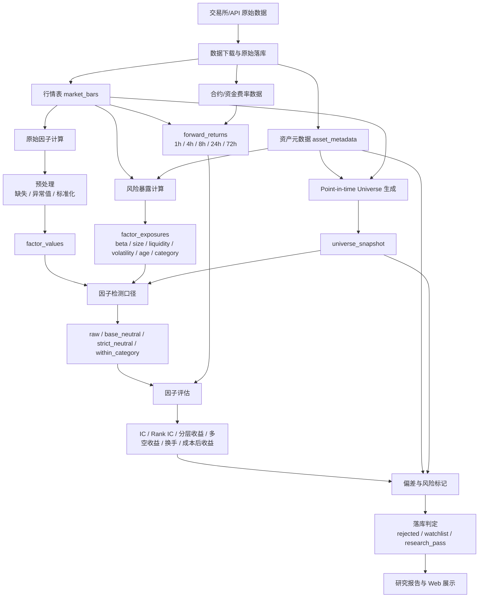
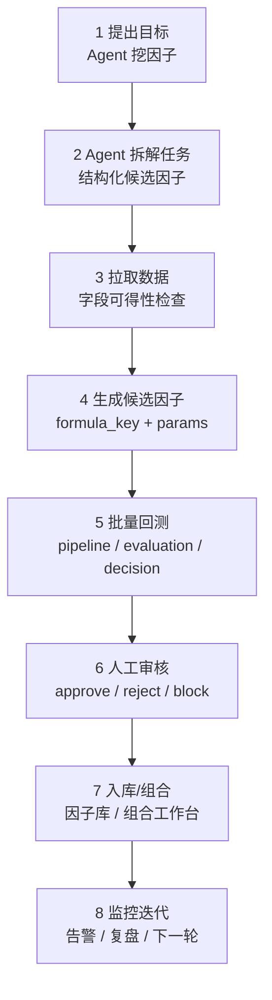

# ARCHITECTURE

## 模块划分
- 文档层：`README.md`、`ARCHITECTURE.md`、`CONTEXT.md`、`FACTOR_CALC_TECH_DETAIL.md`
- UI 设计层：`UI_DESIGN_GUIDE.md`、`ui/agent_factor_ui_overview.png`
- 前端迁移层：`FRONTEND_MIGRATION_PLAN.md`，定义从 Streamlit 原型迁移到 Next.js 产品化前端的技术栈、目录、API 边界和阶段计划
- UI 调度层：`UI_AGENT_ORCHESTRATION_TEMPLATE.md`，用于约束 GPT-5.5 主调度、Build Web Apps 设计契约、Browser Use 验收和 GPT-5.3 Sub-Agent 编码分片
- 代码层：
  - `src/factor_research/models`：字段口径对应的数据结构（dataclass）
  - `src/factor_research/config`：profile 口径映射与 YAML 配置读取
  - `src/factor_research/data`：交易所公共 API 数据采集（Binance -> Coinbase fallback）
  - `src/factor_research/storage`：DuckDB 建表、幂等写入（market_bars / asset_metadata / universe_snapshot / Agent 实验记忆表）
  - `src/factor_research/runtime`：从 DuckDB 读取并驱动 V1 流程
  - `src/factor_research/agent_mining`：Agent 因子任务校验、公式白名单、approved-only 任务执行和实验摘要
  - `src/factor_research/pipeline`：因子预处理、中性化、正交化、主流程编排
  - `src/factor_research/evaluation`：Rank IC、覆盖率、分层多空收益与落库判定
  - `src/factor_research/workflow.py`：把 profile 配置桥接到 pipeline 的 V1 流程入口
  - `scripts/run_v1_demo.py`：最小 mock 数据端到端验收脚本
  - `scripts/ingest_market_data.py`：真实行情入库脚本
  - `scripts/run_v1_from_db.py`：DB 驱动评估脚本
  - `scripts/run_agent_factor_tasks.py`：读取 Agent 任务文件，执行已审核任务并写入实验记忆表
  - `scripts/start_ui.py` / `scripts/start_ui.cmd`：受限环境下的 Streamlit 原型 UI 启动入口
  - `ui/app.py`：最小可用 Streamlit UI，保留为研究原型和数据联调入口
  - `frontend/`：计划中的 Next.js App Router 前端工程目录，负责产品化 UI、组件化工作台和浏览器验收

## 数据流/调用关系
当前仓库已具备真实数据 + DB + 评估 + UI 的第一版链路：
1. 从交易所公共 API 拉取行情和交易对元数据（Binance 优先，受限时回退 Coinbase）
2. 写入 DuckDB（`market_bars` / `asset_metadata` / `universe_snapshot`）
3. 从 DuckDB 读取样本，按 universe 快照过滤后构造因子输入并运行 pipeline
4. 运行 evaluation 与 decision，输出 `rejected/watchlist/research_pass`
5. 当前 Streamlit 原型直接读取 DuckDB 展示行情与评估结果
6. 目标 Next.js 前端通过 Python API 读取任务、实验、评估、判定和数据覆盖，不直接承载因子计算逻辑

Agent 挖因子后端第一版已补齐受控执行链路：
1. 从 `configs/agent_factor_tasks.yaml` 读取结构化任务
2. 校验任务字段、状态、方向、horizon 和 `formula_key`
3. 只有 `approved` 任务进入执行，其他状态写入 skipped
4. 检查 `market_bars` 字段可得性，缺字段任务写入 `blocked`
5. 通过白名单公式生成 `raw_factor`
6. 按 horizon 与 profile 复用 pipeline/evaluation/decision
7. 写入 `agent_factor_tasks`、`agent_factor_experiments`、`factor_evaluation`、`factor_decision`

Universe 口径：当 `universe_snapshot` 有多期快照时，后端按每根 K 线时间匹配最近一次历史 universe 快照，避免使用未来成分；当前样例库只有单期快照时会走 `single_snapshot_fallback`，只用于 smoke test 和 UI 联调。

Agent 挖因子升级后的目标链路按 UI 用户流程组织，后端状态机要能支撑每一步：
1. 用户在 `Agent 挖因子` 页面提出目标
2. Agent 拆解任务并生成结构化候选因子
3. 系统检查并拉取所需数据，缺失字段进入 `blocked`
4. 任务执行器用白名单公式生成候选因子
5. 复用现有 pipeline/evaluation/decision 批量回测
6. 用户人工审核，只有确认后的结果进入因子库
7. 因子可加入组合工作台，配置权重和风险约束
8. 监控与告警页面持续跟踪衰减、漂移和缺数，并触发下一轮 Agent 复盘

## 关键设计决策
- 第一版定位研究闭环，不做生产交易执行。
- 当前阶段聚焦因子检测，不引入完整交易策略模板；策略差异先抽象为因子检测口径。
- 市场范围覆盖现货与永续。
- 因子计算流程采用“先清洗和标准化，再中性化，再正交化，再评估”的顺序。
- 因子计算细节由 `FACTOR_CALC_TECH_DETAIL.md` 统一维护，并要求与实现代码对齐。
- 第一版只使用稳定的 `primary_category` 做板块中性化/板块内检测，动态叙事标签后续作为因子扩展。
- Universe 与元数据必须支持 point-in-time 口径，避免当前成分回看、下架币删除和标签回看造成幸存者偏差或未来函数。
- 字段含义与状态枚举统一由 `DATA_LABEL_DICTIONARY.md` 维护。
- 因子研究注意事项和偏差检查统一由 `FACTOR_RESEARCH_NOTES.md` 维护。
- Agent 挖因子第一版采用人工确认执行：只有 `approved` 任务进入检测系统。
- Agent 输出的自由文本公式不能直接执行；第一版必须转换为 `formula_key + formula_params`，并通过公式白名单运行。
- 第一版公式白名单支持 `close_momentum`、`volume_zscore`、`volatility`，参数先限制为正整数 `window`。
- Agent 不是裁判，不修改验收阈值；裁判仍是现有 evaluation、decision 和 acceptance 配置。
- funding、OI、爆仓、盘口等数据缺失时，相关任务进入 `blocked`，等数据源接入后再执行。
- Agent UI 以 `UI_DESIGN_GUIDE.md` 和 `ui/agent_factor_ui_overview.png` 为唯一视觉与交互基准；后续页面生成必须向浅色、圆润、卡通研究助理工作台收敛。
- 前端技术路线切换为 Next.js App Router + React + TypeScript + Tailwind CSS；Streamlit 只保留为研究联调和 smoke test 原型。
- Next.js 不重写 Python 因子研究核心，必须通过受控 API 与 `src/factor_research`、DuckDB 和 Agent 任务执行链路交互。
- Next.js 侧的数据库/API/SDK 客户端不得在模块顶层初始化，避免构建阶段因环境变量或资源缺失失败。

## 已知约束
- 已接入真实公共数据源，但 Binance 在部分网络环境可能返回 `HTTP 451`，系统会自动回退 Coinbase。
- 目前是脚本级最小验收，尚未补齐自动化测试框架。
- Crypto 历史下架、交易暂停、代币迁移和动态标签数据源可能不完整，第一版需显式标记数据质量风险。
- Agent 挖因子第一版只规划受控任务闭环，不包含 RL、MCTS、GFlowNet 或自主搜索执行。
- Next.js 前端尚未初始化，当前仍以 Streamlit 页面提供临时可视化入口。

## 执行协作策略
- 默认采用并行拆分 + sub agent 执行（数据源/存储、流程计算、UI/文档）。
- 主线程负责冲突收敛、端到端验收、code review 和最终交付。
- UI 系统实现采用 GPT-5.5 主线程调度：先用 Build Web Apps 建立视觉与交互契约，再把可独立实现的代码分片交给 GPT-5.3 Sub-Agents，最后用 Browser Use 做本地页面加载、核心交互、控制台错误、桌面/移动视口和视觉一致性验收。
- Sub-Agent 必须声明职责和写入范围；主线程不接受越界修改，并负责最终合并、文档同步和风险说明。
