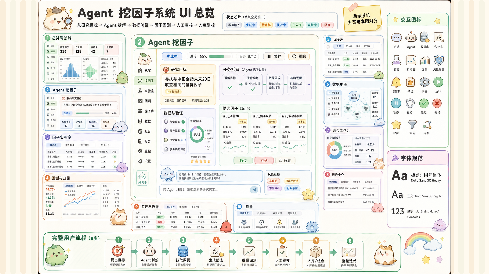

# UI_DESIGN_GUIDE

## 视觉基准

当前 Agent 挖因子系统的唯一 UI 总览设计图（Ultra HD 7680×4320）：



后续所有 UI 生成、页面重设计和交互原型都应优先参考这张总览图，并向它收敛：

- 风格：浅色、圆润、治愈系卡通感、柔和金融研究工具；避免深色交易终端风。
- 情绪：像“可爱研究助理工作台”，而不是高压交易面板。
- 结构：以 `Agent 挖因子` 为主工作台，其他页面围绕用户研究流程展开。
- 交互：用可爱的圆角图标、状态贴纸、小助手形象和任务卡片表达复杂流程，但数据区仍要保持可读、可比较。
- 字体：标题使用圆润黑体 / Noto Sans SC Heavy；正文使用 Noto Sans SC Regular；数字使用 JetBrains Mono / Consolas。
- 一致性：总览图是唯一视觉基准；后续开发不得随意改动图中的栏目、控件、文案、图标、状态、颜色和数据示例，不再维护额外参考图、派生子图或 4x 图，避免视觉口径分叉。

## 页面体系

第一版前端应按以下页面组织：

1. `总览驾驶舱`：展示任务状态、活跃 Agent、因子发现进度、组合健康度。
2. `Agent 挖因子`：核心入口，包含研究目标输入、Agent 对话、任务拆解、候选因子、人工审核。
3. `因子实验室`：展示公式草案、字段覆盖、公式白名单映射、验证警告。
4. `回测与归因`：展示累计收益、回撤、IC/ICIR、换手、分市场状态表现。
5. `因子库`：展示已入库因子、标签、质量评分、谱系、收藏和复用入口。
6. `数据地图`：展示交易所、标的、OHLCV、funding、OI、盘口、链上和情绪数据接入状态。
7. `组合工作台`：选择因子、配置权重、设置风险约束和 paper/live 状态。
8. `报告中心`：生成研究备忘录、PDF 导出、评审分享链接。
9. `监控与告警`：监控因子衰减、漂移、缺数、重跑提醒。
10. `设置`：配置模型、数据权限、交易所 key、定时任务、团队角色。

## 用户使用流程

UI 和后端任务闭环都要围绕同一条流程设计：

```text
1 提出目标
-> 2 Agent 拆解任务
-> 3 拉取数据
-> 4 生成候选因子
-> 5 批量回测
-> 6 人工审核
-> 7 入库/组合
-> 8 监控迭代
```

这条流程是后续页面状态、任务状态、按钮文案和后端状态机的对齐基准。

## 交互图标

后续图标应保持同一套圆润卡通线性图标语言，至少覆盖：

- 对话、Agent 闪光、数据库、公式 `fx`、实验烧杯、折线图、回测时钟
- 风险盾牌、告警铃、导出文件、设置齿轮、运行、暂停、重跑
- 审核通过、审核拒绝、收藏星标、筛选漏斗、因子谱系分支

## 实现约束

- 首屏必须能看到 `Agent 挖因子` 的核心工作流，而不是营销式首页。
- 用户每一步都应能看到当前状态：等待输入、Agent 生成中、待审核、执行中、已入库、监控中。
- 对高风险动作保留人工确认：执行任务、入库、加入组合、开启 live/paper 运行。
- 图表和表格要服务研究判断，不能为了卡通风牺牲数据密度和可读性。
- 新 UI 生成时必须同时检查是否覆盖页面体系、用户流程、图标体系和字体体系。
- 产品化前端技术栈采用 Next.js App Router + React + TypeScript + Tailwind CSS；Streamlit 仅作为临时研究原型保留。
- Next.js 页面应优先组件化拆分为 shell、状态芯片、工作台、候选因子、数据地图、因子库、监控告警和报告模块。
- 前端通过受控 Python API 读取 DuckDB 与 Agent 任务状态，不在浏览器或 Next.js 页面中直接执行研究脚本。
